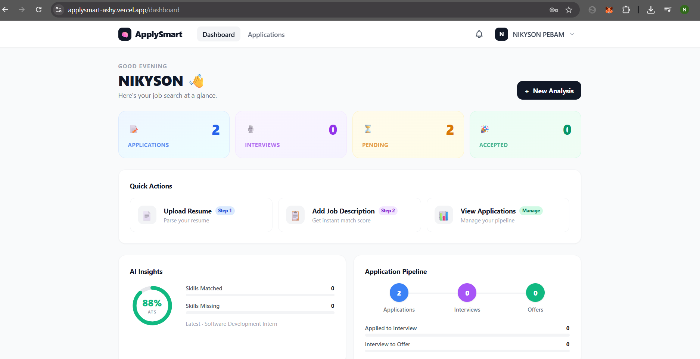
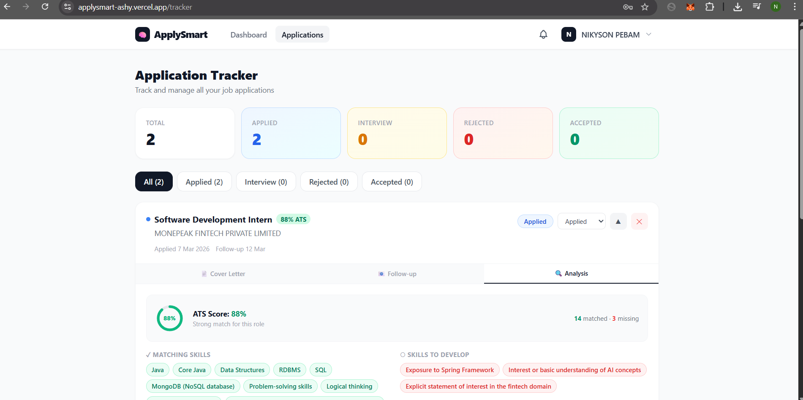

# ApplySmart

ApplySmart is an AI-powered job application assistant that helps users optimize resumes, analyze job descriptions, and manage job applications intelligently.

The platform combines AI analysis, resume management, and application tracking to streamline the job search process.

---

# Live Demo

🌐 https://applysmart-ashy.vercel.app

---

# Screenshots

### Dashboard


### Application Tracker with AI Analysis


---

# Project Structure

```
applysmart/
applysmart-spring/    → Authentication Service (Spring Boot)
applysmart-node/      → AI + Application Service (Node.js)
applysmart-frontend/  → Frontend Application (React)
docs/                 → Architecture & API documentation
```

---

# Features

**AI Resume Analysis**
Automatically compare resumes with job descriptions and generate ATS-style match scores.

**Cover Letter Generator**
Generate personalized cover letters using AI based on the job description and resume.

**Follow-Up Email Generator**
Create professional follow-up emails for job applications.

**Application Tracker**
Track job applications, statuses, and follow-up reminders. View full AI analysis results per application including matched and missing skills.

**Smart Notifications**
Receive real-time notifications via Socket.IO.

**Secure Authentication**
JWT-based authentication with email OTP verification and 2FA on every login.

---

# Technology Stack

**Frontend**
* React
* Vite
* Axios
* Context API
* Socket.IO Client

**Authentication Service**
* Java 17
* Spring Boot
* Spring Security
* JWT Authentication
* MySQL
* Brevo (transactional email API)

**AI Application Service**
* Node.js
* Express
* MongoDB Atlas
* Gemini AI
* Socket.IO
* Node-Cron

---

# Architecture Overview

1. User registers and verifies email via OTP through the Spring Boot authentication service.
2. On every login, a fresh OTP is sent and verified before issuing a JWT.
3. Frontend stores the JWT token.
4. Frontend communicates with the Node.js AI service using the JWT.
5. Node.js validates the JWT by calling Spring Boot's /api/auth/validate endpoint.
6. Resumes are parsed in memory — no disk storage required.
7. Gemini AI generates analysis, cover letters, and follow-up emails.
8. Real-time updates are delivered using Socket.IO.

---

# Deployment

| Service | Platform | URL |
|---|---|---|
| Frontend | Vercel | https://applysmart-ashy.vercel.app |
| Spring Boot | Railway | https://applysmart-production-c3b2.up.railway.app |
| Node.js | Railway | https://applysmart-production.up.railway.app |
| MySQL | Railway | Managed MySQL plugin |
| MongoDB | MongoDB Atlas | Free M0 cluster |
| Email | Brevo | HTTP API, 300 emails/day free |

---

# Security

* JWT authentication with access and refresh tokens
* 2FA — OTP required on every login
* Email verification on registration
* Unverified accounts auto-deleted after 24 hours
* Role-based access control
* Sensitive values stored in environment variables

---

# Documentation

Additional documentation can be found in the docs/ directory.

* ARCHITECTURE.md — system design and service overview
* AUTH_API.md — authentication API reference
* PROJECT_ROADMAP.md — development progress and planned features
* CONTRIBUTING.md — development guidelines

---

# Status

ApplySmart is live and deployed in production.
Active development continues with new features being added.